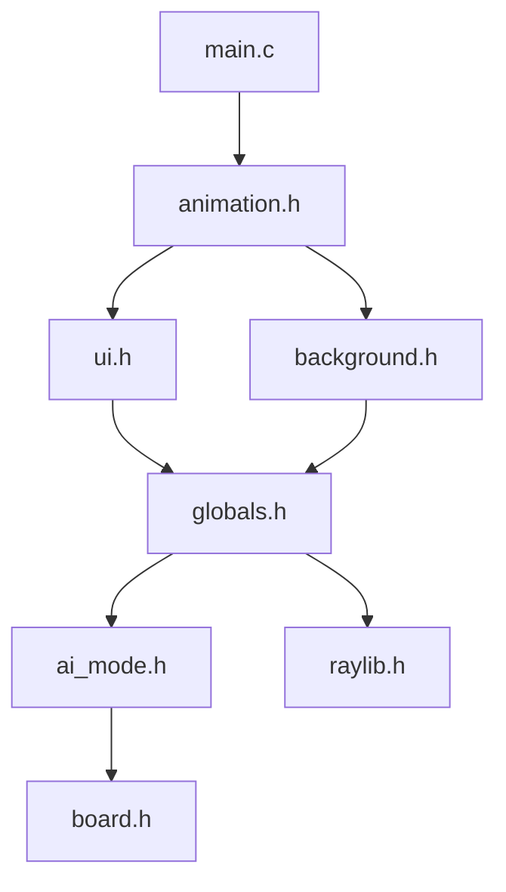

# 2048_animation_and_auto_algorithm
Based on ralib for animation and minimax pruning algorithm, a 2048 game implemented in C.  
这是一个使用 raylib 库搭配参考开源算法实现的 2048 窗口小游戏，为大一项目。
## 头文件引用关系图

```mermaid
graph TD
    main.c --> animation.h
    animation.h --> ui.h
    animation.h --> background.h
    ui.h --> globals.h
    background.h --> globals.h
    globals.h --> ai_mode.h
    globals.h --> raylib.h
    ai_mode.h --> board.h
```
