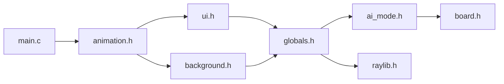

# 2048_animation_and_auto_algorithm
本项目为大一项目，复现经典网页版 2048 小游戏。代码为 c 语言，使用 raylib 库实现动画，并参考开源算法实现自动决策。

## 游玩方法及界面简介
当前程序仅在 Windows 端通过测试，尽管代码有对 Linux 端的适配，但不能保证功能稳定。
### 下载
下载当前文件夹下的 `2048.exe` 文件并双击运行，即可开始游玩。
### 界面
进入为主菜单界面，有四个大小的棋盘，选择之后进入棋盘界面；右下角有退出按钮，点击退出游戏，也可直接从右上角关闭窗口。  
进入棋盘界面后，若当前棋盘有保存的进度，则提示是否继续上次进度，没有则默认初始棋盘。  
棋盘界面左半部分为棋盘，上方为当前分数和历史最高分，右侧有两列按钮，第一列上四个为主题颜色，点击切换，下五个为移动特效按钮，第二列为自动模式按钮，默认关闭，点击切换速度，下方为随机颜色开关，默认关闭；右下角为返回主菜单和直接退出按钮。  
通过键盘输入控制方向，可使用英文键盘 WASD （不限制大小写）或箭头 ↑ ↓ ← → 或数字键盘 5213 （类似上下左右）控制，允许混用。自动决策期间对键盘输入无响应，从主界面进入棋盘时有两帧（约 0.03 秒）对键盘输入无响应（防误触），胜利或失败有 0.4 秒对键盘输入无响应。  
```
WASD 区域：             方向键：                 数字小键盘：
    ┌───┐                  ┌───┐                    ┌───┐
    │ W │                  │ ↑ │                    │ 5 │
    └───┘                  └───┘                    └───┘
┌───┌───┌───┐          ┌───┌───┌───┐            ┌───┌───┌───┐
│ A │ S │ D │          │ ← │ ↓ │ → │            │ 1 │ 2 │ 3 │
└───┴───┴───┘          └───┴───┴───┘            └───┴───┴───┘
```
移动动画仅在键盘控制时呈现，在自动决策期间无移动动画。
### 存档
存档文件默认在 `C:\用户\用户名\AppData\Roaming\My2048`，首次进入游戏时创建，有两个 `.dat` 文件，分别存储主题和特效偏好，以及四个棋盘的最高分和上次退出时棋盘状态。  
若发现分数保存不正常，可能是游戏版本更新后不兼容以前存档文件，建议把旧文件直接删除后重启游戏，应当会恢复正常。  

## 代码简介
代码已全部开源，在 `code` 文件夹中，仅供参考学习。  
### 代码文件结构
代码文件夹包含六个自定义库以及对应头文件、一个 `main.c`、一个 `.dev` 项目文件以及两个 `icon` 图标文件（仅用于显示程序图标）。  
#### 头文件引用关系图

对 `.c` 文件的介绍在其文件开头用注释呈现。  
### 编译运行
#### 方法一：使用 Dev-C++（推荐）
1. **安装 Dev-C++**（如已安装请跳过）。
2. **安装 raylib 库**：
   - 下载 raylib 开发包（Windows 版，MinGW 兼容，本项目所用版本号为 raylib-4.0.0_win64_mingw-w64）：[https://github.com/raysan5/raylib/releases](https://github.com/raysan5/raylib/releases)
   - 解压到任意目录，例如 `D:\raylib`
3. **配置 Dev-C++**：
   - 打开 Dev-C++，菜单栏：`工具` → `编译选项` → `目录`
   - **C 包含文件**：添加 `D:\raylib\include`
   - **库文件**：添加 `D:\raylib\lib`
   - 链接器命令行中加入：`-lraylib -lopengl32 -lgdi32 -lwinmm -mwindows`
4. **打开项目**：双击 `2048.dev` 文件，或通过 Dev-C++ 打开。
5. **编译运行**：按 `F11` 或点击“编译运行”按钮。
#### 方法二：使用 build.bat（需要 MinGW）
1. 确保系统已安装 **MinGW-w64** 并配置好 `gcc` 环境变量。
2. 下载 raylib 并解压到任意路径，例如 `D:\raylib-4.0.0_win64_mingw-w64`。
3. 将 `code` 文件夹中所有文件放到同一个本地文件夹中。
4. 编辑 `build.bat`，修改以下两行为你的实际路径：
   ```batch
   set RAYLIB_DIR=D:\raylib-4.0.0_win64_mingw-w64
   set MINGW_DIR=D:\MinGW64\MinGW64
5. 双击 `build.bat` 即可自动编译并运行游戏。

## 其他
### 许可证
本项目的搜索算法基于 [https://github.com/Zager-Zhang/2048-AI-Python](https://github.com/Zager-Zhang/2048-AI-Python) 的算法逻辑，使用 C 语言重写，属于其衍生作品。因此，根据 **GNU General Public License v3.0** 的要求，本项目同样以 **GPL v3.0** 许可证开源。  
您可以自由使用、修改、分发本代码，但必须：
- 保留原始版权和许可证声明；
- 公开所有修改后的源代码；
- 使用相同的 GPL v3.0 许可证发布衍生作品。

详见项目中的 [LICENSE](./LICENSE) 文件。  
**重要说明**：如果您使用了本项目的代码，您的项目也必须以 GPL v3.0 许可证开源。
### 已知问题与限制
- **自动决策与动画冲突**：当前代码无法同时实现自动决策与移动动画的兼容，个人认为是 bug 导致，但实力有限无法解决，详细内容见代码注释。  
- **存档兼容性**：未来版本可能改变存档格式，旧存档文件可能引发异常。如遇问题，请删除 `%APPDATA%\My2048` 下的所有 `.dat` 文件后重试。  
- **Linux 支持**：代码虽对 Linux 做了部分适配，但未充分测试，可能存在编译或运行问题。  
### 版本与依赖
- **游戏版本**：1.1.0  
- **raylib 版本**：4.0.0 (Windows, MinGW-w64)  
- **编译器**：GCC 9.3.0 或更高（MinGW-w64）  
- **操作系统**：Windows 10/11
